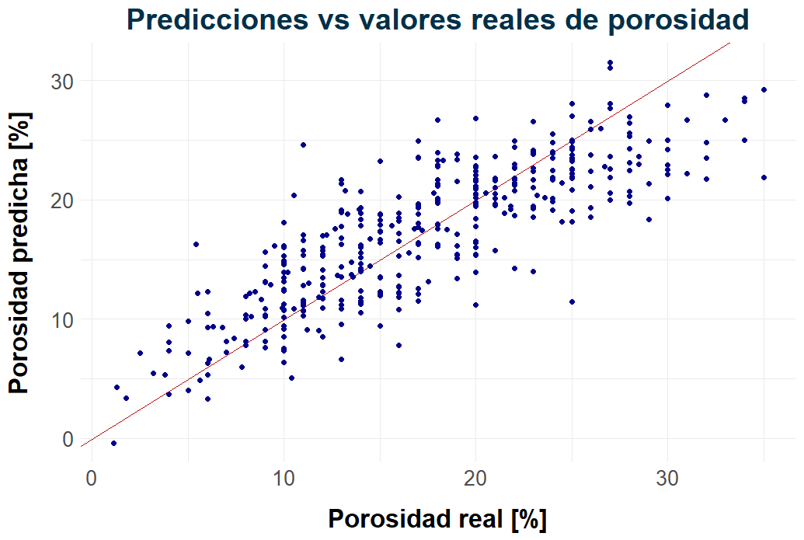

# 🛢️ De la roca al hidrocarburo: ¿dónde hacer un pozo?

Análisis exploratorio y modelado predictivo sobre datos de yacimientos hidrocarburíferos de todo el mundo bajo el marco del **Trabajo Práctico Final** para la materia *Introducción a la Ciencia de Datos* (LCD-UNSAM).

---

## 📚 Contexto

Para el año 2025, la demanda global de hidrocarburos sigue en aumento. Sin embargo, la producción muestra una tendencia decreciente debido al cierre de plataformas, la baja productividad y otros factores.
Ante este escenario, una estrategia posible para mitigar el desequilibrio entre oferta y demanda es optimizar la fase de _upstream_ mediante la identificación de pozos con **reservorios de mayor calidad**.

## 🎯 Descripción del Problema
La calidad de un reservorio está determinada, en gran parte, por la porosidad de sus rocas, es decir, por la proporción de espacios vacíos donde puede almacenarse el hidrocarburo, expresado como porcentaje de las mismas.
El problema es que medir la porosidad requiere perforaciones y estudios de subsuelo que representan cerca del **40% del costo total de exploración**. Esto vuelve ineficiente el proceso, ya que implica incurrir en altos costos sin certezas previas, dificultando así la optimización del modelo de negocio.

## 💡 Solución propuesta
Este proyecto explora la posibilidad de **predecir la porosidad de un reservorio** a partir de variables geológicas disponibles antes de perforar, como la litología, la profundidad o el espesor. Para ello, se construyó un modelo de regresión lineal que permite estimar esta propiedad clave sin incurrir en los elevados costos de exploración directa.
En caso de lograr predicciones precisas, esta estrategia podría reducir el riesgo económico y técnico asociado a la perforación de pozos con baja calidad de reservorio, optimizando así la toma de decisiones en etapas tempranas del proceso exploratorio

## 📊 Resultados principales
La porosidad puede predecirse a partir de variables geológicas conocidas antes de perforar el suelo. El modelo de regresión lineal alcanzó un buen desempeño predictivo...

- **R² Score:** 0.68
- **Error absoluto medio:** 4% (porcentaje de espacio poroso de la roca)
- **Variables más importantes:** permeabilidad, profundidad y periodo geológico

Además, se observó una relación lineal aceptable entre los valores predichos y los reales, como muestra el siguiente gráfico:
<p align="center">  </p>
    
## 📁 Estructura del proyecto
```
OilGas-ICD-TPF/
├── data/                       # Datasets utilizados
│   ├── oil_test.csv
│   └── train_oil.csv
├── images/                     # Gráficos y visualizaciones
├── slides/
│   └── presentacion_TPF.pdf    # Apoyo visual para exposición en clase
├── script.R                    # Código fuente del análisis realizado
├── README.md
└── LICENSE  
```

## 📩 Datos utilizados
Los datos provienen de un desafío abierto alojado en la plataforma *Kaggle*, orientado al aprendizaje automático aplicado a yacimientos de petróleo y gas de todo el mundo junto a características geográficas, geologicas y estructurales de los mismos.
Fuente: https://www.kaggle.com/competitions/oilgas-field-prediction/data

## 🛠️ Tecnologías Utilizadas
- **R 4.4.2**
- **RStudio**
- **Tidyverse** - Limpieza, transformación y análisis de datos.
- **ggplot2** - Generación de gráficos exploratorios y visualizaciones personalizadas.
- **dplyr & stringr** - Procesamiento de datos y manipulación de texto.
- **sf, rnaturalearth y rnaturalearthdata** - Representación geoespacial de los yacimientos.
- **modelr** - Generación de modelos de regresión lineal.

## 📈 Metodología
1. **Preparación de datos**: se unificaron datasets, se tradujeron variables al español y se realizó una limpieza intensiva para garantizar la coherencia y completitud de los registros.

2. **Transformaciones y reagrupamientos**: se agruparon categorías geológicas, se convirtieron unidades al sistema métrico y se aplicaron transformaciones logarítmicas y categorizaciones para mejorar la modelización.

3. **Análisis exploratorio**: se utilizaron visualizaciones para identificar patrones entre la porosidad y distintas variables geológicas (como litología, profundidad, espesor, etc.).

4. **Modelado predictivo**: se construyeron modelos de regresión lineal múltiple, evaluando distintas especificaciones con inclusión progresiva de variables e interacciones.

5. **Evaluación del modelo**: se validaron supuestos del modelo y se analizaron los residuos para asegurar un buen ajuste.

## 🧠 Conclusiones y Aprendizajes
- Los datos geológicos previos a la perforación (litología, edad, espesor, permeabilidad) permiten anticipar la calidad del reservorio y deben integrarse en las decisiones de inversión. Es preciso entonces considerar reservorios:
    - con <b>*alta permeabilidad*</b>, ya que esto se asocia a una mejor conectividad porosa. 
    - de <b>*menor espesor bruto*</b> y ubicados a <b>*poca profundidad*</b>.
    - formados en <b>*períodos geológicos más recientes*</b>, en lugar de aquellos más antiguos.

- Incorporar más variables al modelo puede complejizar la interpretación sin mejorar sustancialmente la explicación del fenómeno.
- El desequilibrio en algunas categorías limitó el análisis de ciertos efectos; trabajar con datos más balanceados podría mejorar la robustez de los resultados.
- Incluir nuevas variables como presión, temperatura o facies podría capturar aspectos clave no observados en este análisis

## 🧑‍💻 Autores | Contacto
Estamos abiertos a recibir ideas, sugerencias o comentarios! Podes contactarnos por LinkedIn o Gmail.
- **Bruno Inguanzo** · [LinkedIn](https://www.linkedin.com/in/bruno-inguanzo-974021212/) · [brunoinguanzo14@gmail.com](mailto:brunoinguanzo14@gmail.com)
- **Emanuel Pinasco** · [LinkedIn](https://www.linkedin.com/in/emanuel-pinasco/) · [pinascoemanuel@gmail.com](mailto:pinascoemanuel@gmail.com) 
- **Javier Valdez** · [LinkedIn](https://www.linkedin.com/in/javiervaldez2/) · [javiervaldez145@gmail.com](mailto:javiervaldez145@gmail.com) 
- **Matías Vergara** · [LinkedIn](https://www.linkedin.com/in/matiasvergaravicencio/) · [hola.matiasv@gmail.com](mailto:hola.matiasv@gmail.com)
